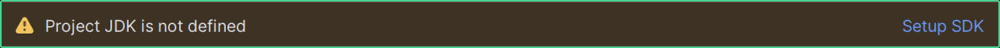
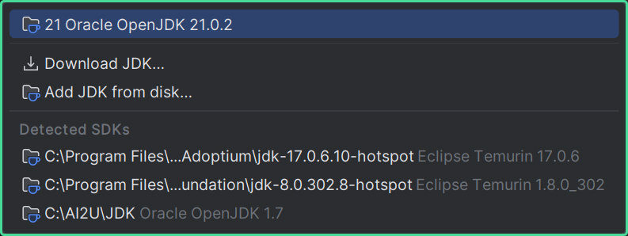
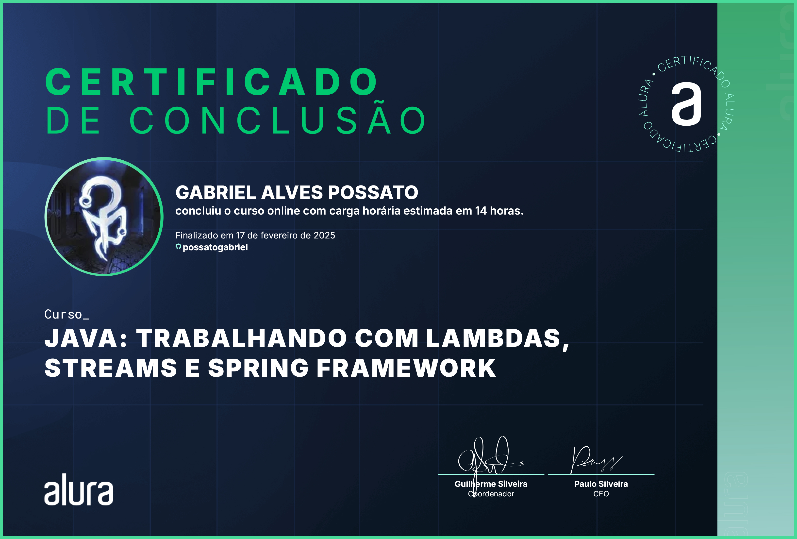

# 🚗 BusCarros

## 📰 Descrição

Projeto final do primeiro curso na segunda formação de Java da Alura

Esse projeto permite que você **busque um modelo específico de um *carro, moto ou caminhão* para mostrar suas informações, como preço médio, tipo do combustível, marca...**

> Esse projeto utiliza da <a href = "https://deividfortuna.github.io/fipe/?ref=public_apis&utm_medium=website">FIPE API</a>
> - *Há **mudanças e implementações individuais ao código** que o fazem ser **mais simples de ler e entender***  

## 💻 Tecnologias Utilizadas
`Trabalhado durante o curso:`

 
          

## 🛠️ Como executar o programa

- Passo 1: Utilizando a <a href = "https://www.jetbrains.com/pt-br/idea/">IDE do Intellij,</a> clique em **"Setup SDK"**

- Passo 3: Clique em **"Download JDK"**

- Passo 4: Instale a versão mais recente (ou, em caso de problemas, ***instale a versão demonstrada na imagem***)

- Passo 5: Após a instalação, procure a classe principal e execute o programa

## 🏅 Certificado de Conclusão 

## 🙋 Autores
[    Gabriel Possato ](https://github.com/possatogabriel)
 
 

    

